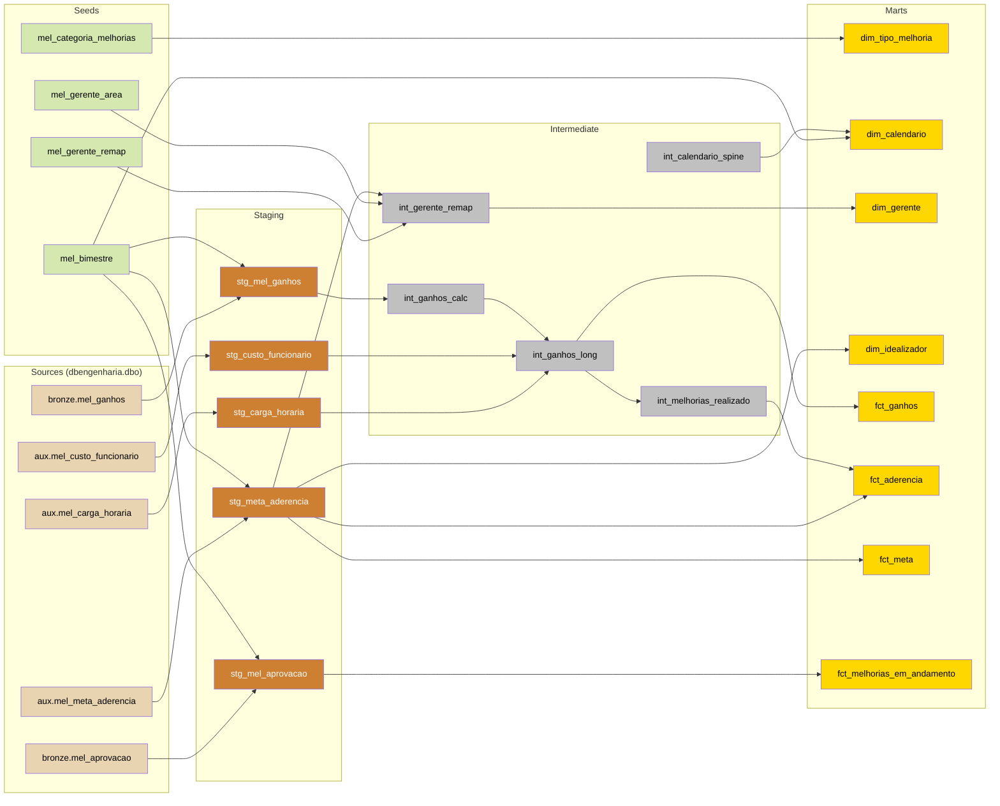
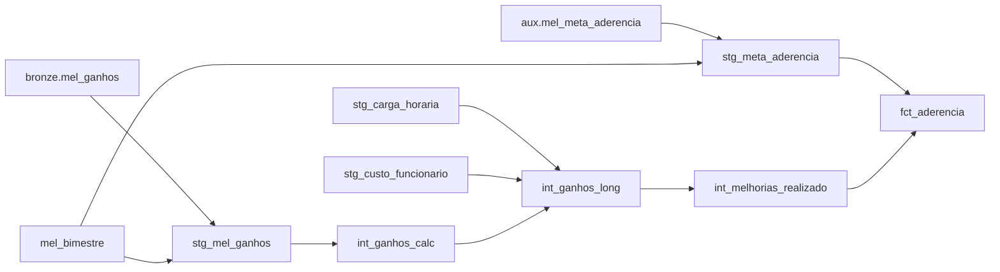
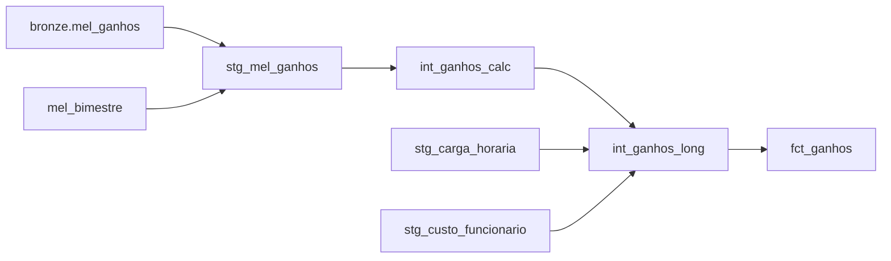
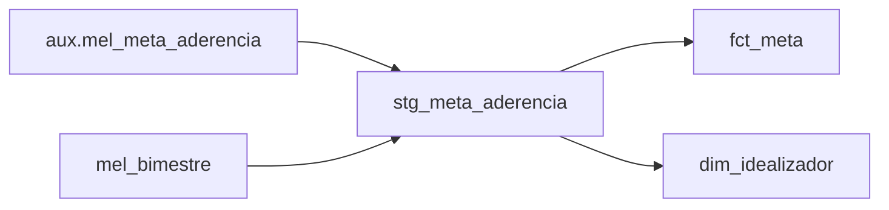
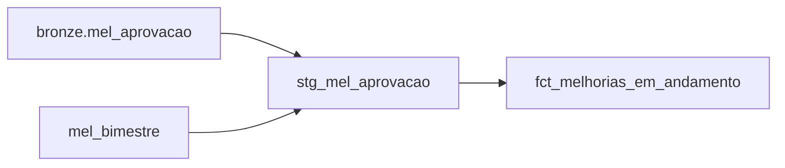
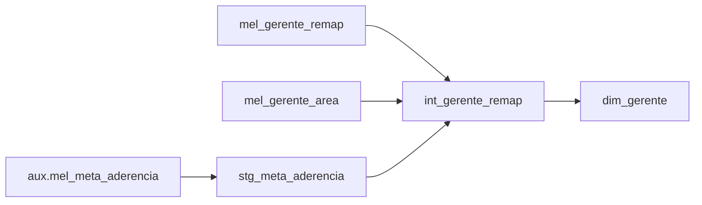

# Linhagem de dados — dbt melhorias

Fluxo de dados do projeto dbt `melhorias`, da origem (SQL Server `dbengenharia`) até os
fatos e dimensões de consumo do Power BI. Arquitetura medallion:
**Sources → Staging → Intermediate → Marts**.

A linhagem aqui é derivada do `target/manifest.json` (gerado no build do dbt) — fonte
canônica das dependências `ref()`/`source()`. Para regenerar após mudanças nos modelos,
rode o dbt (build/compile) e atualize este documento conforme o novo manifest.

> ADR 0001: todos os modelos são materializados como **VIEW** no schema `dbo`
> (limite de 10 GB, import do Power BI). Seeds também vivem em `dbo`.

## Diagrama global

## Diagramas focados por fato

Subgrafos de impacto: o que muda quando se altera um upstream de cada fato.

### fct_aderencia — meta × realizado

Grão (bimestre, crachá idealizador). Cruza a meta (roster elegível) com o realizado de
melhorias por idealizador.

### fct_ganhos — caminho de ganhos LONG

Uma linha por (FAP, mês de competência 1..4). Conversão para R$ por tipo em
`int_ganhos_long` (ADR 0003).

### fct_meta / dim_idealizador — roster da meta

Ambos saem direto do roster da meta (`stg_meta_aderencia`, tabela central).

### fct_melhorias_em_andamento — pipeline não aprovado

Melhorias ainda sem `dt_fap` (não aprovadas). Fora dos fatos de aprovadas (ADR 0003).

### dim_gerente — remap + área

## Modelos

Todos materializados como `view` em `dbo`.

| Modelo | Camada | Upstream imediato | Descrição |
|---|---|---|---|
| stg_mel_aprovacao | staging | bronze.mel_aprovacao, mel_bimestre | Limpeza 1:1 do bronze; deriva `dt_fap` (aprovado e nulo → `dt_aprovacao_eng`, ADR 0003) e bimestre canônico. |
| stg_mel_ganhos | staging | bronze.mel_ganhos, mel_bimestre | Limpeza 1:1 do bronze; `dt_fap` nativo → bimestre direto, sem join com aprovação. |
| stg_meta_aderencia | staging | aux.mel_meta_aderencia, mel_bimestre | Limpeza 1:1; tabela CENTRAL — grão (bimestre, crachá). Deriva flag `elegivel` e bimestre canônico. |
| stg_carga_horaria | staging | aux.mel_carga_horaria | Limpeza 1:1 das horas trabalhadas mensais por setor. |
| stg_custo_funcionario | staging | aux.mel_custo_funcionario | Limpeza 1:1 do custo mensal por estabelecimento. |
| int_ganhos_calc | intermediate | stg_mel_ganhos | Cálculo de ganhos ainda WIDE (meses 1..4 em colunas). Espelha `base_melhoria` do Qlik. |
| int_ganhos_long | intermediate | int_ganhos_calc, stg_carga_horaria, stg_custo_funcionario | Ganhos LONG: uma linha por (FAP, mês 1..4) com `ganho_reais` convertido por tipo (ADR 0003). |
| int_calendario_spine | intermediate | — | Date spine manual (compatível com SQL Server 2008; evita WITH aninhado do dbt_utils). |
| int_gerente_remap | intermediate | stg_meta_aderencia, mel_gerente_remap, mel_gerente_area | Remap de gerente (janela de data) + lookup de área; fall-through mantém gerente original. |
| int_melhorias_realizado | intermediate | int_ganhos_long | Realizado por (bimestre, crachá idealizador): FAP com `ganho_fap >= 0`. Entra no fct_aderencia. |
| dim_tipo_melhoria | mart | mel_categoria_melhorias | Dimensão de tipo de melhoria + categoria. |
| dim_calendario | mart | int_calendario_spine, mel_bimestre | Calendário diário; link dos fatos por `dt_fap`/`dt_competencia` (ADR 0003). |
| dim_gerente | mart | int_gerente_remap | Dimensão de gerente já remapeado + área. |
| dim_idealizador | mart | stg_meta_aderencia | Dimensão de idealizador; grão (bimestre, crachá) — atributos variam por bimestre. |
| fct_ganhos | mart | int_ganhos_long | Fato de ganhos LONG por (FAP, mês 1..4); `ganho_reais` em R$. Chaveado em (bimestre, crachá). |
| fct_aderencia | mart | stg_meta_aderencia, int_melhorias_realizado | Fato de aderência: meta × realizado. Grão (bimestre, crachá idealizador). |
| fct_meta | mart | stg_meta_aderencia | Fato de meta: alvo por gerente/bimestre (roster elegível). |
| fct_melhorias_em_andamento | mart | stg_mel_aprovacao | Pipeline de melhorias NÃO aprovadas (`dt_fap` nulo). Referenciada por `created` (ADR 0003). |

## Sources

`bronze` e `aux` são **source names do dbt** (agrupamento lógico por origem do dado),
**não schemas** — todas as tabelas vivem no schema físico `dbengenharia.dbo`. A notação
`bronze.mel_ganhos` segue a convenção dbt `source_name.tabela` (= `source('bronze',
'mel_ganhos')`), que resolve para `dbengenharia.dbo.mel_ganhos`. `bronze` = ingerido das
listas SharePoint pelas DAGs Airflow; `aux` = populado via planilha + VBA (sem DAG).
Ver ADR 0002 (conexão eng via env var).

| Source | Relation | Descrição |
|---|---|---|
| bronze.mel_aprovacao | `dbengenharia.dbo.mel_aprovacao` | Fluxo de aprovação/assinatura das melhorias (FAP/FAO). |
| bronze.mel_ganhos | `dbengenharia.dbo.mel_ganhos` | Ganhos das melhorias (TC, consumo, troca MP, outros). |
| aux.mel_meta_aderencia | `dbengenharia.dbo.mel_meta_aderencia` | Meta por gerente/bimestre + roster RH elegível. |
| aux.mel_carga_horaria | `dbengenharia.dbo.mel_carga_horaria` | Carga horária mensal por setor. |
| aux.mel_custo_funcionario | `dbengenharia.dbo.mel_custo_funcionario` | Custo do funcionário mensal por estabelecimento. |

## Seeds

Carregados manualmente no SQL Server (DBeaver/SQL), não via `dbt seed`. Os CSVs em
`seeds/` ficam só como referência/contrato de schema; os `ref()` resolvem para as
tabelas `dbo.mel_*` criadas à mão. Ver ADR 0004.

| Seed | Descrição |
|---|---|
| mel_bimestre | Mapa mês (1-12) → bimestre (jan-fev .. nov-dez). |
| mel_categoria_melhorias | Mapa Tipo de Melhoria → Categoria (planilha). |
| mel_gerente_remap | Remap de gerente (cadeia `if` do Qlik): origem → destino, com `valido_ate` opcional. |
| mel_gerente_area | Lookup de área pelo nome do gerente já ajustado (planilha gerentes). |
